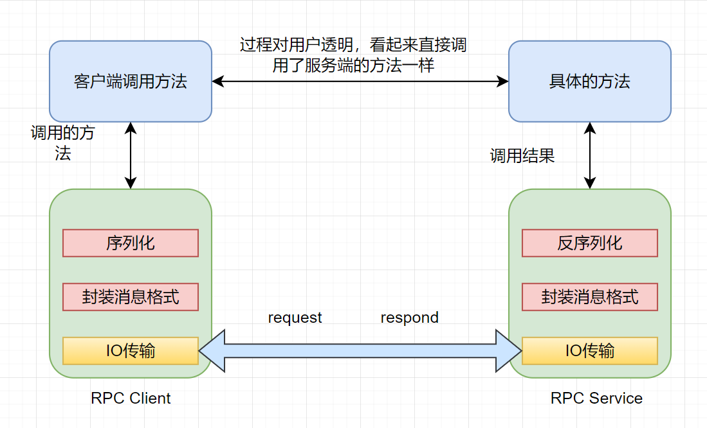
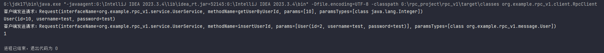
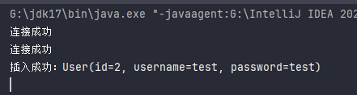
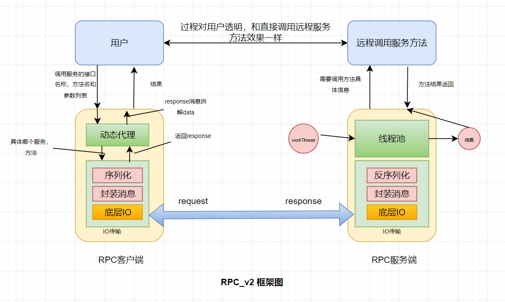
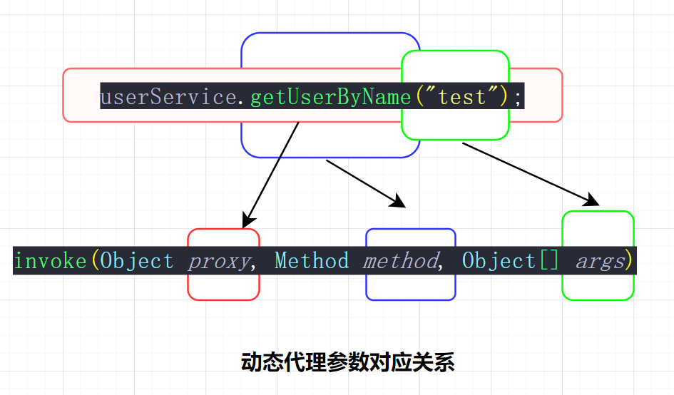
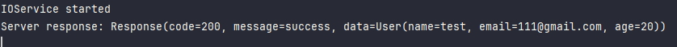
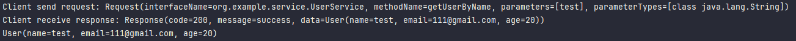

# RPC项目总结

[TOC]


## 版本v1

### 回顾问题：

我们在v0版本采用的是直接利用socket通信放回我们想要的信息结果，但是有很明显的问题存在：我们只能调用接口中的一个方法，返回值确定的，定死了。甚至我们要传过去参数。总之就是十分固定，一点拓展性都没有。

### 需求：

要做出客户端可以调用接口中的不同方法，过程对用户透明，理论上我们只要指定我们要调用哪个接口的哪个方法，然后传入参数即可。

### 框架图：



这次我们对客户端和服务端进行了封装，提供序列化反序列化。消息的格式也进行了封装，底层采用BIO进行传输，用户在调用过程中是感觉不到的，看起来就像是直接调用了服务端的方法一样。

### 前置知识：

1.BIO  2.反射  3动态代理

---

### 具体代码过程：

首先我们写公共部分，首先定义消息格式：

Request格式

```java
@Data
@Builder
public class Request implements Serializable {
    private String interfaceName;
    private String methodName;
    private Object[] params;
    private Class<?>[] paramsTypes;
 }
```

解释：因为我们要做到客户端要告诉服务端，我们要调用哪个接口，接口中的哪个方法，参数类型以及参数列表是什么。


Response格式

```java
@Data
@Builder
public class Response implements Serializable {
    private int code;
    private String message;
    private Object data;

    public static Response success(Object data){
        return Response.builder().code(200).message("调用成功").data(data).build();
    }

    public static Response fail(String message){
        return Response.builder().code(500).message(message).build();
    }

}
```

解释：服务端需要返回状态码，状态信息和调用方法之后所放回的数据。


实体类，比如这里的User

```java
@Data
@Builder
public class User implements Serializable {
    private Integer id;
    private String username;
    private String password;
}
```

---

接下来，我们按照框架图一步一步往下写：

我们来到最底层的IO传输，IOClient要做的就是传request过去，拿response回来，IOService要做的就是拿到request分析完之后，将request向上层传递，然后拿到上层传下来的结果封装成response返回回去。

IOClient

```java
public class IOClient {

    public static Response sendRequest(String ip, int port, Request request) throws IOException {
        try(Socket socket = new Socket(ip, port);){
            ObjectOutputStream oos = new ObjectOutputStream(socket.getOutputStream());
            ObjectInputStream ois = new ObjectInputStream(socket.getInputStream());
            oos.writeObject(request);
            oos.flush();
            System.out.println("客户端发送请求："+request);
            return (Response) ois.readObject();
        } catch (ClassNotFoundException e) {
            System.out.println("从IO流中读取数据失败");
            throw new RuntimeException(e);
        }

    }
}
```

服务端复杂一点，因为我们这个将调用具体的方法也给写一块了


IOService

```java
public class IOService {
    public static void main(String[] args) throws IOException {
        UserService userService = new UserServiceImpl();

        try {
            ServerSocket serverSocket = new ServerSocket(8090);
            while(true){
                Socket socket = serverSocket.accept();
                System.out.println("连接成功");
                new Thread(() -> {
                    try {
                        ObjectOutputStream oos = new ObjectOutputStream(socket.getOutputStream());
                        ObjectInputStream ois = new ObjectInputStream(socket.getInputStream());

                        Request request = (Request) ois.readObject();
                        Method method = userService.getClass().getMethod(request.getMethodName(), request.getParamsTypes());
                        Object result = method.invoke(userService, request.getParams());
                        oos.writeObject(Response.success(result));
                        oos.flush();


                    } catch (IOException | ClassNotFoundException | InvocationTargetException | IllegalAccessException |
                             NoSuchMethodException e) {
                        throw new RuntimeException(e);
                    }
                }).start();
            }
        } catch (IOException e) {
            throw new RuntimeException(e);
        }
    }
}
```

注意这句话：


其实就是框架图中的返回给上层，然后上层调用方法之后返回结果给IO层。所以这代码应该叫做RPCService，因为实际包含了两层的内容

然后最后，我们补上具体的要调用的接口和实现类即可：


UserService——业务接口

```java
public interface UserService {
    User getUserByUserId(Integer id);
    Integer insertUserId(User user);
}
```

UserServiceImpl——具体的业务实现类

```java
public class UserServiceImpl implements UserService {
    @Override
    public User getUserByUserId(Integer id) {
        return User.builder().id(id).username("test").password("test").build();
    }

    @Override
    public Integer insertUserId(User user) {
        System.out.println("插入成功："+user);
        return 1;
    }
}
```

---

我们似乎已经完成了整个过程，那我们直接写用户如何调用即可了

我们尝试写一下：

```java
public class RPCClient{
    public static void main(String[] args){
        Request request = Request.builder()
            .methodName("getUserByUserId")
            .params(new Object[]{1}).paramsTypes(new Class[]{Integer.class}).build();
        
        Response response = IOClient.sendRequest("127.0.0.1",8090,request);
        User data = (User) response.getData();
    }
}
```

emm...好像没有多大毛病，但是这里只是调用了接口中的一个方法，我们来调用另一个方法看看

```java
public class RPCClient{
    public static void main(String[] args){
        Request request1 = Request.builder().methodName("insertUserId").params(new Object[]{User.builder().id(2).username("test").password("test").build()}).paramsTypes(new Class[]{User.class}).build();
        
        Response response1 = IOClient.sendRequest("127.0.0.1",8090,request1);
        Integer data1 = (Integer) response1.getData();
    }
}
```

emm...好像乍看没什么毛病，但是我们发现其实对用户不透明。什么意思呢，我们要自己封装request，我们要做到的是可以像本地一样的，类似，

xxx.xxxmethod(xxx)的形式。

也就是做到像这样的，同一个对象去执行，利用动态代理模式，

```java
public class RPCClient{
    public static void main(String[] args){
        ...
        
        proxy.getUserByUserId(1);
        proxy.inserUserId(user);
    }
}
```

也就是我们要对以上过程封装，很简单，封装以上几步：

```java
		//1.封装request
		Request request= xxx;
        //2.IO传输
        Response response = IOClient.sendRequest("127.0.0.1",8090,request);
        //3.调用具体类返回结果
        response.getData();
```

需要注意的是，这个封装要一般话，什么意思呢，不同的方法用的代码是同一套，这很简单，利用发射，所以我们利用动态代理封装一下

```java
@AllArgsConstructor
public class ClientProxy implements InvocationHandler {
    private String ip;
    private int port;
    @Override
    public Object invoke(Object proxy, Method method, Object[] args) throws Throwable {
        Request request = Request.builder()
                .interfaceName(method.getDeclaringClass().getName())
                .methodName(method.getName())
                .params(args)
                .paramsTypes(method.getParameterTypes())
                .build();
        Response response = IOClient.sendRequest(ip, port, request);
        if(response.getCode() == 200){
            return response.getData();
        }else{
            throw new RuntimeException("调用失败："+response.getMessage());
        }

    }

    public <T> T getProxy(Class<T> clazz){
        Object o = Proxy.newProxyInstance(clazz.getClassLoader(), new Class<?>[]{clazz}, this);
        return (T) o;
    }
}
```

动态代理执行后，每次我们调用getProxy方法得到一个Proxy代理类实例后，都会去调用invoke方法，执行封装reques，底层IO发送，封装response，返回结果。

我们重新写一下我们的用户如何调用：

```java
public class RpcClient {
    public static void main(String[] args) throws IOException {
        ClientProxy clientProxy = new ClientProxy("127.0.0.1",8090);
        UserService proxy = clientProxy.getProxy(UserService.class);
        User user = proxy.getUserByUserId(10);
        System.out.println(user);
        User user1 = User.builder().id(2).username("test").password("test").build();
        Integer integer = proxy.insertUserId(user1);
        System.out.println(integer);
    }
}
```

### 结果：





### 总结：

1.使用了更加通用的消息格式，reques，respone更加清晰

2.框架层次结构更加清晰，通过代理模式可以调用服务的不同方法

3.客户端耦合度降低，不与特定ip端口服务绑定

### 问题：

1.只能调用一个服务（接口）里面的方法，我们在服务端是写死在里面的，所以要解决可以注册更多的服务（接口）

2.层次耦合度还是太高，看看能不能松耦

3.BIO效率太低了，每次都是阻塞的，看看怎么提升

---

## 版本v2

### 回顾问题：

在版本v1中，我们的服务端代码耦合度太高，并且能调用什么接口的方法已经是写死的了，所以我们在版本v2中就要解决这个问题。

### 需求：

1.对服务端解耦，将IO运输和上层调用接口方法解耦开

2.我们不写死接口方法在服务端中，我们让客户端可以选择多个接口方法。这个很简单，用map就能够解决。

### 框架图：



---

### 前置知识：

1.线程池  2.map

---

### 具体代码过程：

我们还是从客户端开始，从最上层开始写起。

首先，我们还是一样定义消息体格式：

Request

```java
@Data
@Builder
public class Request implements Serializable {
    private String interfaceName;
    private String methodName;
    private Object[] parameters;
    private Class<?>[] parameterTypes;
}
```

Responce

```java
@Data
@Builder
public class Response implements Serializable {
    private int code;
    private String message;
    private Object data;

    public static Response success(Object data) {
        return Response.builder().code(200).message("success").data(data).build();
    }

    public static Response fail(String message) {
        return Response.builder().code(500).message(message).build();
    }

}
```

还有公共的实体类：

User

```java
@Data
@Builder
public class User implements Serializable {
    private String name;
    private String email;
    private int age;

}
```

当然，这个版本我们为了体现出可以灵活的调用不同的接口方法，我们再写一个实体类：

Blog

```java
@Data
@Builder
public class Blog implements Serializable {
    private String title;
    private String content;
    private User author;
}
```

ok,以上就不多解释了，消息格式和版本v1是一样的，我们继续往下。

---

我们先从客户端入手，似乎和之前没有什么不同，还是发送request，接收responce，然后拆开来得到结果。所以我们先来写IOClient：

IOClient

```java
@Data
@Builder
public class IOClient {
    public static Response sendRequest(String ip, int port, Request request) throws IOException {
        try{
            Socket socket = new Socket(ip,port);
            ObjectOutputStream oos = new ObjectOutputStream(socket.getOutputStream());
            ObjectInputStream ois = new ObjectInputStream(socket.getInputStream());
            oos.writeObject(request);
            oos.flush();
            System.out.println("Client send request: " + request);

            Response response = (Response) ois.readObject();
            System.out.println("Client receive response: " + response);
            return response;
        } catch (ClassNotFoundException e) {
            System.out.println("Client receive response error");
            throw new RuntimeException(e);
        }

    }
}
```

和之前v1版本是一样的，不多讲解。

下面我们来看看服务端：

也是从底层IO运输开始写起：

IOService

```java
public class IOService {
    public static void main(String[] args) throws IOException {
        UserService userService = new UserServiceImpl();

        try {
            ServerSocket serverSocket = new ServerSocket(8090);
            while(true){
                Socket socket = serverSocket.accept();
                System.out.println("连接成功");
                new Thread(() -> {
                    try {
                        ObjectOutputStream oos = new ObjectOutputStream(socket.getOutputStream());
                        ObjectInputStream ois = new ObjectInputStream(socket.getInputStream());

                        Request request = (Request) ois.readObject();
                        Method method = userService.getClass().getMethod(request.getMethodName(), request.getParamsTypes());
                        Object result = method.invoke(userService, request.getParams());
                        oos.writeObject(Response.success(result));
                        oos.flush();


                    } catch (IOException | ClassNotFoundException | InvocationTargetException | IllegalAccessException |
                             NoSuchMethodException e) {
                        throw new RuntimeException(e);
                    }
                }).start();
            }
        } catch (IOException e) {
            throw new RuntimeException(e);
        }
    }
}
```

这是之前v1版本的，我们看看有哪里可以改进的。

首先：

```java
 UserService userService = new UserServiceImpl();
```

我们观察到这句话，我们前面也提到了，服务写死了，也就是只能去调用UserService接口里的方法了，那如果我们要调用其他服务的方法怎么办呢？

比如说我们现在多了一个Blog，多了一个服务接口BlogService，我们要去调用里面的方法，该怎么解决呢？

我们回顾一下在上一个版本客户端是怎么调用远程服务的，我们把代码copy过来看看：

```java
public class RpcClient {
    public static void main(String[] args) throws IOException {
        ClientProxy clientProxy = new ClientProxy("127.0.0.1",8090);
        UserService proxy = clientProxy.getProxy(UserService.class);
        User user = proxy.getUserByUserId(10);
        System.out.println(user);
        User user1 = User.builder().id(2).username("test").password("test").build();
        Integer integer = proxy.insertUserId(user1);
        System.out.println(integer);
    }
}
```

具体调用语句是这个：

```java
UserService proxy = clientProxy.getProxy(UserService.class);
User user = proxy.getUserByUserId(10);
```

那我们将getProxy里面的服务名称换成BlogService.class不就好了吗，不急，我们看看服务端拿到接口名称后是怎么处理的。

```java
Method method = userService.getClass().getMethod(request.getMethodName(), request.getParamsTypes());
Object result = method.invoke(userService, request.getParams());
```

服务端直接调用了userService，也就是你哪怕传进来BlogService，我服务端调用的还是UserService，因为你写死了，那该怎么办呢。

有人会说了，那我直接和之前一样，这么写：

```java
UserService userService = new UserServiceImpl();
BlogService blogService = new BlogServiceImpl();
```

然后我传进去，然后拿到类，然后再根据类的名称来判断，也就是加个判断：

```java
if(request.getInterfaceName()==UserService.class.getName()){
                
}else if(request.getInterfaceName()==BlogService.class.getName()){

}else if...
...
else ...
```

首先有个问题，太麻烦，而且最重要的是耦合度太高了，现实中怎么可能就一两个服务呢，我在实际业务中要新增一个接口服务呢，难道我每次都要进代码里面手动改吗，甚至下面的if逻辑也需要更改。我们的一个原则就是封装，使用我们rpc服务的人应该看不到我们内部的细节才对，也就是，他们只要将他们需要注册到rpc服务端的接口服务注册到服务端上面即可，内部细节不需要他们去更改。

也就是类似这样：

```java
//我有xxx服务,注册到RPCService中
RPCService.register(xxxService);
```

其他的他不需要管。内部对他们是透明的。

咦，刚刚我们的思路是什么，是通过判断接口名找到对应的服务，也就是接口名字和服务存在映射关系，这种映射关系让我们想到一种数据结构，对，就是map。所以我们考虑用map来进行封装。

```java
// 自然的想到用一个Map来保存，<interfaceName, xxxServiceImpl>
UserService userService = new UserServiceImpl();
BlogService blogService = new BlogServiceImpl();
Map<String, Object>.put("***.userService", userService);
Map<String, Object>.put("***.blogService", blogService);

// 此时来了一个request，我们就能从map中取出对应的服务
Object service = map.get(request.getInterfaceName())
```

也就是在服务端那边，如果你有一个新增的服务，直接添加到map中，然后将这个map注册到RPCService即可：

```java
UserService userService = new UserServiceImpl();
BlogService blogService = new BlogServiceImpl();
Map<String, Object> serviceProvide = new HashMap<>();
// 暴露两个服务接口， 即在RPCServer中加一个HashMap
serviceProvide.put("com.ganghuan.myRPCVersion2.service.UserService",userService);
serviceProvide.put("com.ganghuan.myRPCVersion2.service.BlogService",blogService);
```

然后将这个serviceProvide注册到RPCService即可。

好了，目前这个问题暂时解决了，我们继续往下。

下面我们将IOService更改如下：

```java
public class IOService {
    private Map<String, Object> serviceProvide;
    public IOService(Map<String, Object> serviceProvide){
        this.serviceProvide = serviceProvide;
    }
    public static void main(String[] args) throws IOException {
        try {
            ServerSocket serverSocket = new ServerSocket(8090);
            while(true){
                Socket socket = serverSocket.accept();
                System.out.println("连接成功");
                new Thread(() -> {
                    try {
                        ObjectOutputStream oos = new ObjectOutputStream(socket.getOutputStream());
                        ObjectInputStream ois = new ObjectInputStream(socket.getInputStream());

                        Request request = (Request) ois.readObject();
                        Method method = userService.getClass().getMethod(request.getMethodName(), request.getParamsTypes());
                        Object result = method.invoke(userService, request.getParams());
                        oos.writeObject(Response.success(result));
                        oos.flush();


                    } catch (IOException | ClassNotFoundException | InvocationTargetException | IllegalAccessException |
                             NoSuchMethodException e) {
                        throw new RuntimeException(e);
                    }
                }).start();
            }
        } catch (IOException e) {
            throw new RuntimeException(e);
        }
    }
}
```

既然改成这种了就不能直接执行main方法了，得封装一下：

```java
public class IOService{
    // 存着服务接口名-> service对象的map
    private Map<String, Object> serviceProvide;

    public SimpleRPCRPCServer(Map<String,Object> serviceProvide){
        this.serviceProvide = serviceProvide;
    }

    public void start(int port) {
        try {
            ServerSocket serverSocket = new ServerSocket(8090);
            while(true){
                Socket socket = serverSocket.accept();
                System.out.println("连接成功");
                new Thread(() -> {
                    try {
                        ObjectOutputStream oos = new ObjectOutputStream(socket.getOutputStream());
                        ObjectInputStream ois = new ObjectInputStream(socket.getInputStream());

                        Request request = (Request) ois.readObject();
                        Method method = userService.getClass().getMethod(request.getMethodName(), request.getParamsTypes());
                        Object result = method.invoke(userService, request.getParams());
                        oos.writeObject(Response.success(result));
                        oos.flush();


                    } catch (IOException | ClassNotFoundException | InvocationTargetException | IllegalAccessException |
                             NoSuchMethodException e) {
                        throw new RuntimeException(e);
                    }
                }).start();
            }
        } catch (IOException e) {
            throw new RuntimeException(e);
        }
    }

    public void stop(){
    }
}
```

有什么要改吗，有，第一竟然封装成了有start，stop方法，那不妨定义一个接口，只要实现这个接口的都可以当作是RPCService；第二，这部分代码：

```java
ObjectOutputStream oos = new ObjectOutputStream(socket.getOutputStream());
                        ObjectInputStream ois = new ObjectInputStream(socket.getInputStream());

                        Request request = (Request) ois.readObject();
                        Method method = userService.getClass().getMethod(request.getMethodName(), request.getParamsTypes());
                        Object result = method.invoke(userService, request.getParams());
                        oos.writeObject(Response.success(result));
                        oos.flush();
```

这部分代码是去调用服务方法的具体过程，我们进行封装。

第三，我们采用线程池进行优化，提升性能，综上我们改成：

```java
public class IOService implements Service{
    private final ThreadPoolExecutor threadPool;
    private ServiceProvider serviceProvider;
    public IOService(ServiceProvider serviceProvider){
        this.serviceProvider = serviceProvider;
        threadPool = new ThreadPoolExecutor(Runtime.getRuntime().availableProcessors(), 1000, 60, TimeUnit.SECONDS, new ArrayBlockingQueue<>(100));
    }

    public IOService(ServiceProvider serviceProvider, int corePoolSize, int maximumPoolSize, int keepAliveTime, TimeUnit timeoutUnit, BlockingQueue<Runnable> workQueue){
        this.serviceProvider = serviceProvider;
        threadPool = new ThreadPoolExecutor(corePoolSize, maximumPoolSize, keepAliveTime, TimeUnit.SECONDS, workQueue);
    }
    @Override
    public void start(int port) {
        System.out.println("IOService started");
        try{
            ServerSocket serverSocket = new ServerSocket(port);
            while(true){
                Socket socket = serverSocket.accept();
                threadPool.execute(new WorkThread(socket, serviceProvider));
            }
        } catch (IOException e) {
            throw new RuntimeException(e);
        }
    }

    @Override
    public void stop() {

    }
}
```

其中Service接口定义如下：

```java
public interface Service {
    void start(int port);
    void stop();
}
```

这样我们前面说的耦合度太高也解决了，充分解耦了。

下面我们只要来专注WorkThread的编写就好了。

```java
@Override
    public void run() {
        try {
            ObjectOutputStream oos = new ObjectOutputStream(socket.getOutputStream());
            ObjectInputStream ois = new ObjectInputStream(socket.getInputStream());
            Request request = (Request) ois.readObject();
            Response response = getResponse(request);
            oos.writeObject(response);
            oos.flush();
            System.out.println("Server response: " + response);
        } catch (IOException | ClassNotFoundException e) {
            throw new RuntimeException(e);
        }
    }
```

首先编写底层IO的过程，很简单就是传过去一个request，你给我一个responce。

拿到request第一是要去解析里面的信息然后去调用上层的具体服务然后再返回，这里我们将这个过程封装成getResponce(Request request)方法。

下面，我们来具体编写一下：

```java
private Response getResponse(Request request) {
        String interfaceName = request.getInterfaceName();
        Object service = serviceProvider.getService(interfaceName);
        Method method = null;
        try{
            method = service.getClass().getMethod(request.getMethodName(), request.getParameterTypes());
            Object result = method.invoke(service, request.getParameters());
            return Response.success(result);
        } catch (InvocationTargetException | IllegalAccessException | NoSuchMethodException e) {
            throw new RuntimeException(e);
        }
    }
```

首先拿到request中的接口名称，确定要调用哪个接口方法，然后在map中查找该接口名称对应的具体实现方法。然后通过反射去具体调用方法。然后将结果返回。

似乎我们已经解决了。

我们再看看还有什么可以改进的，对，map那里。我们再封装成map的时候需要自己手动提供接口名称和接口具体实现类，其实我们完全可以通过反射由接口实现类拿到接口名称的。也就是封装成这样：

```java
public class ServiceProvider {
    private Map<String, Object> interfaceProvider;
    public ServiceProvider(){
        interfaceProvider = new HashMap<>();
    }

    public void provideServiceInterface(Object service){
        String serviceName = service.getClass().getName();
        Class<?>[] interfaces = service.getClass().getInterfaces();
        for(Class<?> i : interfaces){
            interfaceProvider.put(i.getName(), service);
        }
    }

    public Object getService(String interfaceName){
        return interfaceProvider.get(interfaceName);
    }

}
```

我们封装成一个服务提供类，通过反射拿到接口名称，将其写入map中去。

```java
 Class<?>[] interfaces = service.getClass().getInterfaces();
        for(Class<?> i : interfaces){
            interfaceProvider.put(i.getName(), service);
        }
```

可能你会有所疑问，为什么是多个接口对应一个实现类呢？

是这样的，在实际业务中，实现类可以同时实现多个接口。那有人就会说了，我一个接口还对应多个类的，被多个类给实现了。这句话没错，但是我们要注意其实我们需要的是什么，其实需要的只是那个实现类而已，也就是说接口名称只是为了让我能够找到那个实现类罢了。这里没听懂没关系，我们接下看。

现在我们的所有核心代码都实现了，问题也解决了。我们来模拟一下注册环节和客户端调用环节。

注册环节：

```java
public class RPCService {
   public static void main(String[] args) {
       UserService userService = new UserServiceImpl();
       BlogService blogService = new BlogServiceImpl();

       ServiceProvider serviceProvider = new ServiceProvider();
       serviceProvider.provideServiceInterface(userService);
       serviceProvider.provideServiceInterface(blogService);

       IOService ioService = new IOService(serviceProvider);
       ioService.start(8090);

   }
}
```

客户远程调用方法环节：

```java
public class RPCClient {
    public static void main(String[] args) {
        RPCProxy rpcProxy = new RPCProxy("localhost", 8090);
        UserService userService = rpcProxy.getProxy(UserService.class);
        User user = userService.getUserByName("test");
        System.out.println(user);
    }
}
```

这里补一下代理类的代码，和v1是一样的：

```java
@AllArgsConstructor
public class RPCProxy implements InvocationHandler {
    private String ip;
    private int port;

    @Override
    public Object invoke(Object proxy, Method method, Object[] args) throws Throwable {
        Request request = Request.builder()
                .interfaceName(method.getDeclaringClass().getName())
                .methodName(method.getName())
                .parameters(args)
                .parameterTypes(method.getParameterTypes())
                .build();

        Response response = IOClient.sendRequest(ip, port, request);
        if(response.getCode() == 500) {
            throw new RuntimeException(response.getMessage());
        }
        return response.getData();
    }
    public <T> T getProxy(Class<T> clazz) {
        Object o = Proxy.newProxyInstance(clazz.getClassLoader(), new Class<?>[]{clazz}, this);
        return (T) o;
    }
}
```

如果你刚刚有任何疑问，现在我们从调用开始，模拟整个过程，看看能不能解开你的疑问。

首先第一句话：

```java
RPCProxy rpcProxy = new RPCProxy("localhost", 8090);
```

首先new一个我们的代理类对象，啥也没做，将远程服务器的ip和端口传进去了而已。

第二句话：

```java
UserService userService = rpcProxy.getProxy(UserService.class);
```

调用了getProxy()方法，并且将我们要调用的接口服务传进去了，这里我们跳到该方法：

```java
public <T> T getProxy(Class<T> clazz) {
        Object o = Proxy.newProxyInstance(clazz.getClassLoader(), new Class<?>[]{clazz}, this);
        return (T) o;
    }
```

其实就是注册了一个代理类，这里解释一下三个参数：

在 getProxy 方法内部，首先通过 Proxy.newProxyInstance 方法创建了一个新的代理对象。这个代理对象实现了 UserService 接口。Proxy.newProxyInstance 方法的第一个参数是类加载器，用于加载代理类；第二个参数是一个包含一个元素的数组，这个元素就是 UserService.class，表示代理类需要实现的接口；第三个参数是一个 InvocationHandler 对象，这里就是 RPCProxy 对象自身。

也就是说我现在已经有一个代理类对象了，并且这个代理类还实现了UserService接口，那什么意思，根据多态的性质，我可以直接那一个UserService userService去接收这个对象了。那这个InvocationHandler是什么呢，这个是个接口，实现这个接口必须实现invoke方法，也就是会把invoke方法传进去。

这里有个误区，你编写的invoke方法什么时候会执行，不是获得代理类对象的时候执行，而是会在你通过代理对象调用接口方法时被触发。

什么意思，我们往下走。

第三句话：

```java
User user = userService.getUserByName("test");
```

来了，刚刚说的invoke方法会在你通过代理对象调用接口方法时被触发，这句话就是，也就是说这句话会直接去调用invoke方法了，那我们直接看一下我们的invoke方法怎么实现的。

```java
@Override
public Object invoke(Object proxy, Method method, Object[] args) throws Throwable {
    Request request = Request.builder()
        .interfaceName(method.getDeclaringClass().getName())
        .methodName(method.getName())
        .parameters(args)
        .parameterTypes(method.getParameterTypes())
        .build();

    Response response = IOClient.sendRequest(ip, port, request);
    if(response.getCode() == 500) {
        throw new RuntimeException(response.getMessage());
    }
    return response.getData();
}
```

我们先说说参数怎么对应。

具体来说，invoke方法的三个参数是： 

proxy：这是你正在调用方法的代理对象。在例子中，如果你调用userService.getUserByName("test")，那么proxy就是userService。 

method：这是你正在调用的方法的Method对象。在例子中，如果你调用userService.getUserByName("test")，那么method就是getUserByName方法的Method对象。 

args：这是你调用方法时传递的参数。在例子中，如果你调用userService.getUserByName("test")，那么args就是一个包含一个元素的数组，这个元素就是字符串"test"。 

对应图如下：



那么第一步肯定是将我们要调用服务方法的信息给封装成request消息体，也就是代码中的：

```java
Request request = Request.builder()
        .interfaceName(method.getDeclaringClass().getName())
        .methodName(method.getName())
        .parameters(args)
        .parameterTypes(method.getParameterTypes())
        .build();
```

接下来按照我们之前框架图，是交给底层IO运输处理，所以我们是：

```java
Response response = IOClient.sendRequest(ip, port, request);
```

然后拿到response消息体，接下来就是对response进行拆解：

```java
if(response.getCode() == 500) {
        throw new RuntimeException(response.getMessage());
    }
    return response.getData();
```

好，接下来我们继续深入底层IO的具体过程，跳转到IOClient，啥也没做，就是发送一个request，接收一个responce。

那我们看看服务端。

```java
public class RPCService {
   public static void main(String[] args) {
       UserService userService = new UserServiceImpl();
       BlogService blogService = new BlogServiceImpl();

       ServiceProvider serviceProvider = new ServiceProvider();
       serviceProvider.provideServiceInterface(userService);
       serviceProvider.provideServiceInterface(blogService);

       IOService ioService = new IOService(serviceProvider);
       ioService.start(8090);

   }
}
```

注册了服务，然后调用IOService进行底层运输，接下来就不分析了，前面的代码，

```java
System.out.println("IOService started");
try{
    ServerSocket serverSocket = new ServerSocket(port);
    while(true){
        Socket socket = serverSocket.accept();
        threadPool.execute(new WorkThread(socket, serviceProvider));
    }
} catch (IOException e) {
    throw new RuntimeException(e);
}
```

至此我们都分析完了，不知道有没有解决你心中的疑问，如果还有疑问建议自己跟一遍整个通信的过程。

回到我们刚刚问题，我们注册的是具体实现类，这才是有意义的，但是我们客户端调用的是接口方法，所以应该是看具体的实现类对应哪个接口，而不是反过来。

---

代码分析流程我们搞定了。

### 结果：

服务端：



客户端：



---

### 总结：

上一节的问题我们都解决了，服务端充分解耦了，也可以调用多个服务了，层次也更加清晰了。

---

### 问题：

我们基本实现了一个功能完善的RPC了，但是IO通信采用的是BIO，效率比较低下，我们考虑使用NIO或者封装了NIO的高性能网络netty来进行优化。

---


